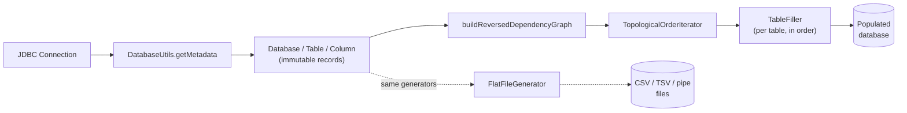
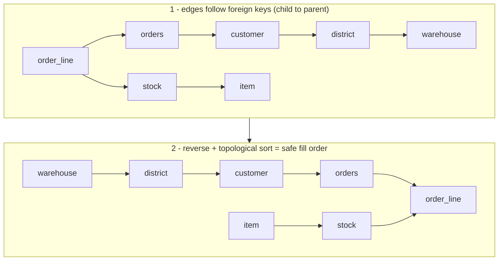
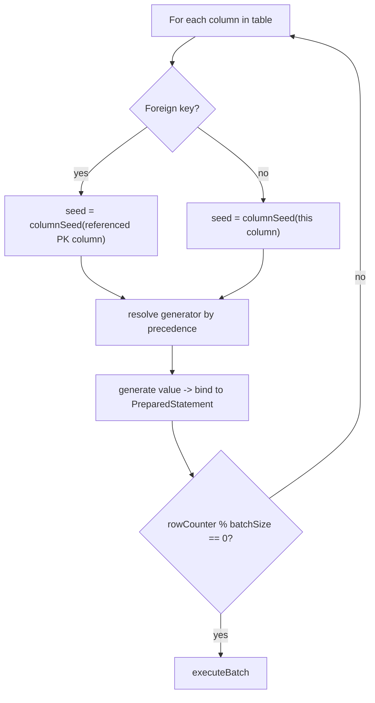
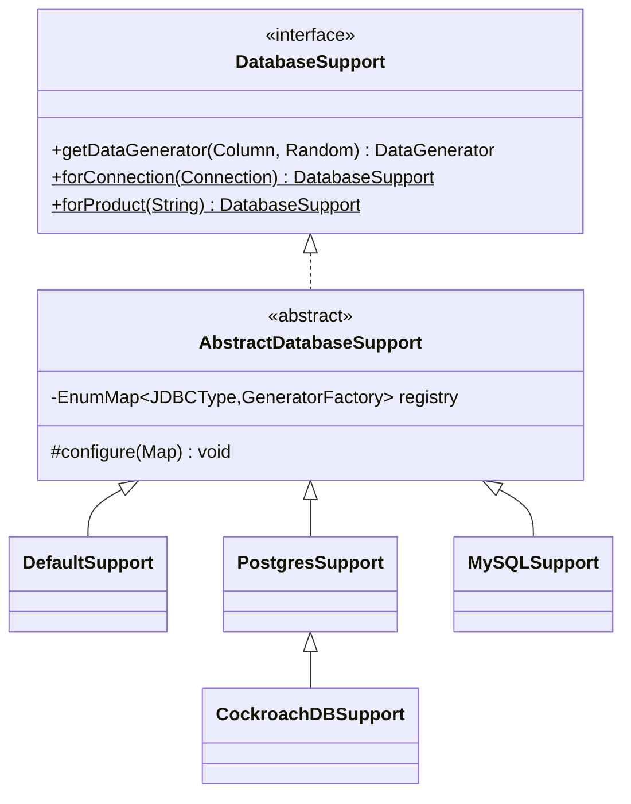
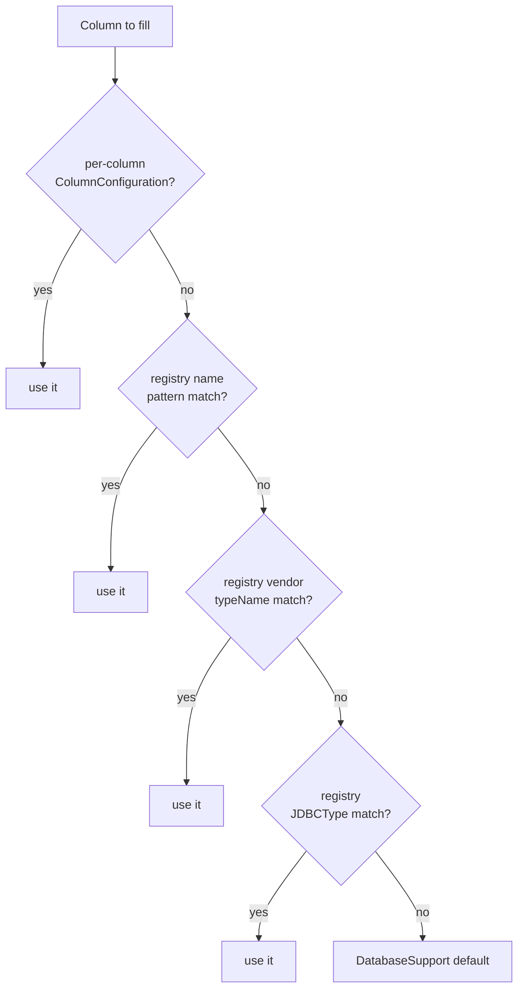
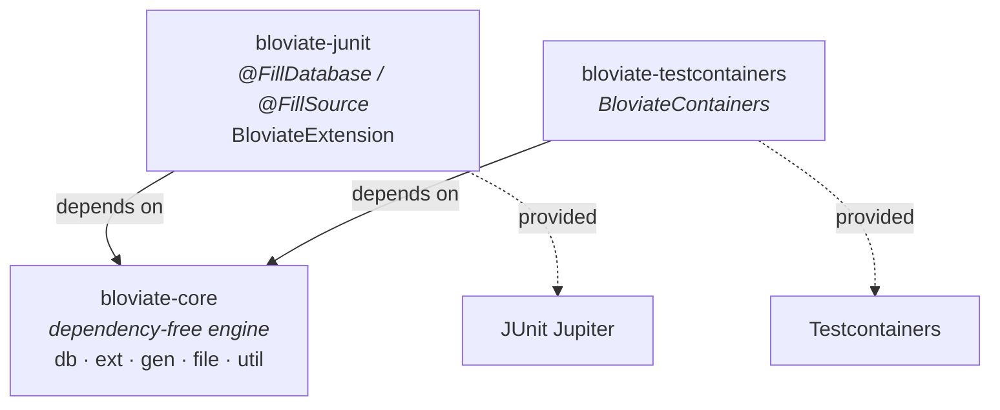

# Bloviate Architecture

This document is a technical deep-dive into **how Bloviate works** — the design decisions and the
genuinely interesting machinery behind the scenes. If you just want to *use* Bloviate, start with
the [README](README.md). If you want to understand it, extend it, or contribute, you're in the
right place.

> All class references below link to real code. Open paths are relative to the repository root.

## Table of Contents

- [The big picture](#the-big-picture)
- [1. Schema introspection — reading the database](#1-schema-introspection--reading-the-database)
- [2. The dependency DAG — fill order via topological sort](#2-the-dependency-dag--fill-order-via-topological-sort)
- [3. Filling a table — generators, batching, and FK fidelity](#3-filling-a-table--generators-batching-and-fk-fidelity)
- [4. Reproducibility — deterministic seeds from schema identity](#4-reproducibility--deterministic-seeds-from-schema-identity)
- [5. Database support — the Strategy pattern](#5-database-support--the-strategy-pattern)
- [6. Pluggable generators — Registry + ServiceLoader](#6-pluggable-generators--registry--serviceloader)
- [7. The generator library — Builder pattern](#7-the-generator-library--builder-pattern)
- [8. Flat-file generation](#8-flat-file-generation)
- [9. Multi-module layout](#9-multi-module-layout)
- [Design patterns at a glance](#design-patterns-at-a-glance)
- [Design principles](#design-principles)

## The big picture

At its core, Bloviate does something deceptively simple to describe: point it at a JDBC database,
and it fills every table with type-appropriate, constraint-respecting, reproducible data. The
interesting part is everything required to make that "just work" without you writing a single line
of generation code.

The end-to-end pipeline:



Two entry points share the same generator engine: [`DatabaseFiller`](bloviate-core/src/main/java/io/bloviate/db/DatabaseFiller.java)
(fill a live database) and [`FlatFileGenerator`](bloviate-core/src/main/java/io/bloviate/file/FlatFileGenerator.java)
(write flat files, no database required).

## 1. Schema introspection — reading the database

Bloviate never asks you to describe your schema — it reads it. [`DatabaseUtils.getMetadata(Connection)`](bloviate-core/src/main/java/io/bloviate/util/DatabaseUtils.java)
walks the standard JDBC [`DatabaseMetaData`](https://docs.oracle.com/en/java/javase/25/docs/api/java.sql/java/sql/DatabaseMetaData.html)
API to discover tables, columns (with type, size, precision, nullability), primary keys, and
foreign keys, then assembles them into an immutable model:

| Record | Represents |
| --- | --- |
| [`Database`](bloviate-core/src/main/java/io/bloviate/db/Database.java) | Catalog + the set of tables |
| [`Table`](bloviate-core/src/main/java/io/bloviate/db/Table.java) | Columns, primary key, foreign keys, generated `INSERT` SQL |
| [`Column`](bloviate-core/src/main/java/io/bloviate/db/Column.java) | `JDBCType`, vendor `typeName`, size/precision, ordinal position |
| [`PrimaryKey`](bloviate-core/src/main/java/io/bloviate/db/PrimaryKey.java) / [`ForeignKey`](bloviate-core/src/main/java/io/bloviate/db/ForeignKey.java) | Key relationships used to build the dependency graph |

These are all Java **records** — immutable, boilerplate-free value types. The metadata model is the
single source of truth that every later stage reads from.

## 2. The dependency DAG — fill order via topological sort

This is the headline feature. You can't insert an order row before the customer it references
exists, so Bloviate has to fill **parent tables before child tables**. It figures the order out
automatically by modeling the schema as a directed graph and topologically sorting it, using the
[JGraphT](https://jgrapht.org/) library.

[`DatabaseFiller.buildReversedDependencyGraph`](bloviate-core/src/main/java/io/bloviate/db/DatabaseFiller.java)
builds a `DefaultDirectedGraph<Table, DefaultEdge>` where each foreign key adds an edge from the
**child** table (the one holding the FK) to the **parent** table it references. It then wraps the
result in an `EdgeReversedGraph` so that a `TopologicalOrderIterator` yields parents *before* the
children that depend on them:



The fill loop is then just:

```java
TopologicalOrderIterator<Table, DefaultEdge> iterator = new TopologicalOrderIterator<>(reversedGraph);
while (iterator.hasNext()) {
    new TableFiller.Builder(connection, database, configuration)
            .table(iterator.next())
            .build().fill();
}
```

**Visualize it for free.** As a nice touch, `DatabaseFiller` exports the graph to
[Graphviz DOT](https://graphviz.org/doc/info/lang.html) notation with JGraphT's `DOTExporter`,
URL-encodes it, and logs a clickable [GraphvizOnline](https://dreampuf.github.io/GraphvizOnline/)
link so you can *see* your schema's dependency graph rendered in the browser — no tooling required.

**Cycle handling.** Self-referencing foreign keys (a table pointing at itself) can't be topologically
ordered cleanly, so they're detected and logged with a warning rather than silently producing broken
data.

## 3. Filling a table — generators, batching, and FK fidelity

[`TableFiller`](bloviate-core/src/main/java/io/bloviate/db/TableFiller.java) handles one table. For
each column it resolves a [`DataGenerator`](bloviate-core/src/main/java/io/bloviate/gen/DataGenerator.java),
then loops `rowCount` times generating values and binding them to a `PreparedStatement`.

**Batch inserts.** Rows are accumulated with `addBatch()` and flushed with `executeBatch()` every
`batchSize` rows (default 1000), with a final flush for the remainder — keeping inserts efficient on
large datasets.

**Foreign-key fidelity.** This is subtle and clever. When a column is a foreign key, Bloviate seeds
its generator from the *referenced primary key column's* seed (see [§4](#4-reproducibility--deterministic-seeds-from-schema-identity)),
so the FK generator reproduces exactly the same value sequence the parent table's PK generator
produced — the values line up by construction. To avoid generating FK values that point at
nonexistent parent rows, a `maxInvocationMap` caps how many distinct values an FK generator emits
(the parent table's row count) and **reseeds** the generator when that boundary is hit, cycling it
back through the same valid value range.



## 4. Reproducibility — deterministic seeds from schema identity

Bloviate datasets are **reproducible across JVM runs, machines, and time** — run it twice against
the same schema with the same base seed and you get byte-for-byte identical data. This is not done
by seeding one global `Random`; it's done *per column*.

[`DatabaseUtils.columnSeed(Column, baseSeed)`](bloviate-core/src/main/java/io/bloviate/util/DatabaseUtils.java)
derives a stable seed by hashing the column's **identity** — its name, table, schema, catalog, JDBC
type name, and ordinal position — and mixing it with the base seed:

```java
int identity = Objects.hash(
        column.name(), column.tableName(), column.schema(), column.catalog(),
        column.jdbcType() == null ? null : column.jdbcType().getName(),
        column.ordinalPosition());
return baseSeed * 1_000_003L + identity;
```

Two important properties fall out of this design:

- **Run-independence.** The seed depends only on schema identity, never on iteration order, hash-map
  ordering, or wall-clock time. The JDBC type's *name* is hashed (not the enum's `ordinal()`), so the
  seed is stable even if the enum changes.
- **FK alignment for free.** Because the seed is a pure function of the column, a foreign key column
  and the primary key it references resolve to the *same* seed — which is exactly what makes the
  FK-fidelity trick in [§3](#3-filling-a-table--generators-batching-and-fk-fidelity) work.

Every generator — built-in, registry-supplied, or per-column override — is constructed with this
engine-managed seed, so reproducibility holds no matter how a column's generator was chosen.

## 5. Database support — the Strategy pattern

Different databases expose different types. [`DatabaseSupport`](bloviate-core/src/main/java/io/bloviate/ext/DatabaseSupport.java)
is the strategy interface that maps a `Column` to a generator; [`AbstractDatabaseSupport`](bloviate-core/src/main/java/io/bloviate/ext/AbstractDatabaseSupport.java)
holds an `EnumMap<JDBCType, GeneratorFactory>` of cross-database defaults and exposes a `configure()`
hook that subclasses override to add or replace entries for vendor-specific types.



| Implementation | Adds on top of the JDBC defaults |
| --- | --- |
| [`DefaultSupport`](bloviate-core/src/main/java/io/bloviate/ext/DefaultSupport.java) | Nothing — cross-database JDBC types only |
| [`PostgresSupport`](bloviate-core/src/main/java/io/bloviate/ext/PostgresSupport.java) | `uuid`, `json`/`jsonb`, `inet`, `cidr`, `macaddr`/`macaddr8`, `interval`, `bit`/`varbit`, `xml`, and `text`/`int` arrays |
| [`MySQLSupport`](bloviate-core/src/main/java/io/bloviate/ext/MySQLSupport.java) | `JSON` columns generate valid JSON instead of arbitrary text |
| [`CockroachDBSupport`](bloviate-core/src/main/java/io/bloviate/ext/CockroachDBSupport.java) | Extends `PostgresSupport` (CockroachDB is PG wire-compatible) |

You don't have to pick manually. `DatabaseSupport.forConnection(connection)` reads
`DatabaseMetaData.getDatabaseProductName()` and selects the right strategy by substring match,
falling back to `DefaultSupport`. (Note: CockroachDB reached via the PG driver reports as
`PostgreSQL` and resolves to `PostgresSupport` — equivalent, since `CockroachDBSupport` adds no extra
behavior.)

## 6. Pluggable generators — Registry + ServiceLoader

Sometimes the type-based default isn't what you want — you want every column named `email` to look
like an email, regardless of its SQL type. The [`GeneratorRegistry`](bloviate-core/src/main/java/io/bloviate/ext/GeneratorRegistry.java)
lets you override generation **without subclassing `DatabaseSupport`**, and external jars can
contribute rules automatically via Java's [`ServiceLoader`](https://docs.oracle.com/en/java/javase/25/docs/api/java.base/java/util/ServiceLoader.html).

A registry supports three matcher kinds, and the fill engine resolves each column through a fixed
precedence chain:



Plugins implement the single-method [`GeneratorPlugin`](bloviate-core/src/main/java/io/bloviate/ext/GeneratorPlugin.java)
SPI and declare themselves in `META-INF/services/io.bloviate.ext.GeneratorPlugin`. Calling
`GeneratorRegistry.Builder.discover()` loads every plugin on the classpath:

```java
GeneratorRegistry registry = new GeneratorRegistry.Builder()
        .registerColumnNamePattern(".*email", (column, random) -> new EmailGenerator.Builder(random).build())
        .registerTypeName("uuid", (column, random) -> new UUIDGenerator.Builder(random).build())
        .discover() // pick up GeneratorPlugin services from the classpath
        .build();
```

Crucially, registry- and plugin-supplied generators are still constructed with the engine's seeded
`Random`, so they remain just as reproducible as the built-ins.

## 7. The generator library — Builder pattern

Every generator implements [`DataGenerator<T>`](bloviate-core/src/main/java/io/bloviate/gen/DataGenerator.java),
which can `generate()` a typed value, `generateAsString()` for flat files, bind itself to a
`PreparedStatement` (`generateAndSet`), and read a value back from a `ResultSet` (`get`). Each is
constructed through a static inner `Builder` seeded with a `Random`:

```java
new SimpleStringGenerator.Builder(random).size(100).build();
new BigDecimalGenerator.Builder(random).precision(10).digits(2).build();
```

The library ships ~50 generators in [`io.bloviate.gen`](bloviate-core/src/main/java/io/bloviate/gen/),
covering everything from primitives and dates to `uuid`, `jsonb`, `inet`/`cidr`, MAC addresses,
intervals, arrays, and XML. A few are worth calling out:

- **Referential-fidelity generators** — `CompositeKeyComponentGenerator`, `ChildKeyComponentGenerator`,
  and `ChildCountGenerator` produce collision-free composite keys and variable parent/child
  cardinalities that keep foreign keys consistent.
- **`GroupedPermutationGenerator`** — emits a deterministic permutation *per group* (e.g. TPC-C's
  shuffled `o_c_id`) using a **Feistel network with cycle-walking**, achieving a unique pseudo-random
  permutation in O(1) memory without materializing or shuffling an array.
- **TPC-C generators** — [`io.bloviate.gen.tpcc`](bloviate-core/src/main/java/io/bloviate/gen/tpcc/)
  provides benchmark-faithful fields (customer last names, zip codes, credit, delivery dates).

## 8. Flat-file generation

The same generators power [`FlatFileGenerator`](bloviate-core/src/main/java/io/bloviate/file/FlatFileGenerator.java),
which needs no database at all. You describe columns with [`ColumnDefinition`](bloviate-core/src/main/java/io/bloviate/file/ColumnDefinition.java)
(name + generator), pick a [`FileType`](bloviate-core/src/main/java/io/bloviate/file/FileType.java)
(`CSV`, `TDV`, or `PIPE`), and `generate()`. Output is written via
[Apache Commons CSV](https://commons.apache.org/proper/commons-csv/), with headers derived from
column names:

```java
new FlatFileGenerator.Builder("output/users")
        .add(new ColumnDefinition("id", new IntegerGenerator.Builder(random).build()))
        .add(new ColumnDefinition("email", new SimpleStringGenerator.Builder(random).build()))
        .rows(1000)
        .build()
        .generate();
```

## 9. Multi-module layout

Bloviate is a Maven reactor. The engine is dependency-free; the integration modules pull in their
framework as a **`provided`** dependency so you bring your own version.



- **[`bloviate-core`](bloviate-core/)** — everything above: introspection, the DAG, generators,
  database support, flat files.
- **[`bloviate-junit`](bloviate-junit/)** — declarative test-data filling. Annotate a test (class or
  method) with [`@FillDatabase`](bloviate-junit/src/main/java/io/bloviate/junit/FillDatabase.java)
  and mark a `DataSource`/`Connection` field with [`@FillSource`](bloviate-junit/src/main/java/io/bloviate/junit/FillSource.java);
  [`BloviateExtension`](bloviate-junit/src/main/java/io/bloviate/junit/BloviateExtension.java) (a
  JUnit `BeforeEachCallback`) auto-detects the right `DatabaseSupport` and fills before each test.
- **[`bloviate-testcontainers`](bloviate-testcontainers/)** — fill a started
  `JdbcDatabaseContainer` in one fluent call via
  [`BloviateContainers.forContainer(...)`](bloviate-testcontainers/src/main/java/io/bloviate/testcontainers/BloviateContainers.java).

## Design patterns at a glance

Bloviate leans deliberately on a small, well-understood set of design patterns. They aren't applied
for their own sake — each one buys a concrete property (extensibility, immutability, testability)
and they compose cleanly. If you've read the Gang of Four, this table is a fast map of where each
pattern lives and what it's doing for us.

| Pattern | Where it lives | What it buys |
| --- | --- | --- |
| **Builder** | Nearly everything: [`DatabaseFiller.Builder`](bloviate-core/src/main/java/io/bloviate/db/DatabaseFiller.java), [`TableFiller.Builder`](bloviate-core/src/main/java/io/bloviate/db/TableFiller.java), every `*Generator.Builder`, [`GeneratorRegistry.Builder`](bloviate-core/src/main/java/io/bloviate/ext/GeneratorRegistry.java), [`FlatFileGenerator.Builder`](bloviate-core/src/main/java/io/bloviate/file/FlatFileGenerator.java), [`BloviateContainers.Builder`](bloviate-testcontainers/src/main/java/io/bloviate/testcontainers/BloviateContainers.java) | Readable construction of objects with many optional, defaulted parameters; immutable results with no telescoping constructors |
| **Strategy** | [`DatabaseSupport`](bloviate-core/src/main/java/io/bloviate/ext/DatabaseSupport.java) + per-database implementations | Database-specific behavior is swappable at runtime; adding a database means adding a class, not editing the engine |
| **Template Method** | [`AbstractDatabaseSupport`](bloviate-core/src/main/java/io/bloviate/ext/AbstractDatabaseSupport.java) seeds defaults, then calls the `configure()` hook | Subclasses customize *only* the vendor-specific slice; the invariant default registry is defined once |
| **Factory** (functional) | [`GeneratorFactory`](bloviate-core/src/main/java/io/bloviate/ext/GeneratorFactory.java), [`ColumnGeneratorFactory`](bloviate-core/src/main/java/io/bloviate/db/ColumnGeneratorFactory.java) | Defers generator creation until the engine can supply a column-seeded `Random`, preserving reproducibility |
| **Registry** | [`GeneratorRegistry`](bloviate-core/src/main/java/io/bloviate/ext/GeneratorRegistry.java) with documented precedence | Override generation by name/type without subclassing; rules resolved in a fixed, predictable order |
| **Service Provider (SPI)** | [`GeneratorPlugin`](bloviate-core/src/main/java/io/bloviate/ext/GeneratorPlugin.java) via `ServiceLoader` | Third-party jars contribute generators by dropping a file on the classpath — zero engine coupling |
| **Strategy / polymorphism** | The [`DataGenerator<T>`](bloviate-core/src/main/java/io/bloviate/gen/DataGenerator.java) hierarchy | One uniform interface (`generate` / bind / read-back) over ~50 type-specific implementations |
| **Iterator** | JGraphT's `TopologicalOrderIterator` in [`DatabaseFiller`](bloviate-core/src/main/java/io/bloviate/db/DatabaseFiller.java) | Fill order is expressed as a traversal, decoupled from graph construction |
| **Adapter** | [`bloviate-junit`](bloviate-junit/) and [`bloviate-testcontainers`](bloviate-testcontainers/) | Wrap the same core engine behind framework-native front-ends (`@FillDatabase`, `BloviateContainers`) |

The payoff is that the two extension axes you actually care about — **"support a new database"** and
**"generate a new kind of value"** — are both open for extension without modifying a line of the
core engine (Open/Closed Principle). Strategy handles the first; Registry + SPI handle the second.

## Design principles

A few themes recur throughout the codebase and explain most of the "why" — they're the result of
deliberate design effort, not incidental:

1. **Read, don't configure.** Schema is introspected from JDBC metadata, not hand-described.
2. **Immutability.** The metadata and configuration models are Java records; registries are built
   once and copied defensively.
3. **Determinism by construction.** Seeds derive from schema identity, never runtime state — so data
   is reproducible and foreign keys align without bookkeeping.
4. **Open for extension, closed for modification.** The Strategy pattern (`DatabaseSupport`) handles
   new databases; the Registry + ServiceLoader (`GeneratorPlugin`) handles new generation rules —
   neither requires touching the engine.
5. **One engine, many front-ends.** Database filling, flat files, JUnit, and Testcontainers all sit
   on the same `bloviate-core` generators.

### What this buys in practice

These principles aren't abstract — they show up as concrete quality properties you can rely on:

- **A dependency-free core.** `bloviate-core` keeps its dependency surface small and pushes JUnit and
  Testcontainers to `provided` scope, so integrating Bloviate doesn't drag a testing framework into
  your runtime classpath, and you bring your own versions.
- **Tested against real databases.** Integration tests run against actual PostgreSQL, MySQL, and
  CockroachDB instances via Testcontainers — not mocks — over real benchmark schemas (TPC-C,
  AuctionMark, Wikipedia). Behavior is verified end-to-end, including the FK ordering and round-trip
  read-back through each generator's `get(ResultSet, ...)`.
- **Reproducibility as a guarantee, not a hope.** Because seeds are pure functions of schema identity,
  "it worked on my machine" datasets are byte-for-byte portable — which is exactly what you want from
  test fixtures and benchmark data.
- **Modern Java, used deliberately.** Records for the immutable model, sealed extension points,
  functional SPIs (`@FunctionalInterface`), and `EnumMap`-backed registries reflect a codebase built
  on Java 25 idioms rather than retrofitted onto them.
- **Thorough documentation.** The public types carry real Javadoc — including the *precedence rules*
  for generator resolution and the CockroachDB/PostgreSQL driver caveat — so the contracts are
  written down, not folklore.

The throughline: Bloviate is a small library that takes its own design seriously. The patterns and
principles above are what let it stay simple to *use* while remaining genuinely extensible underneath.

---

*See also: the [README](README.md) for usage, and [issue #455](https://github.com/timveil/bloviate/issues/455)
for the docs-site effort this content feeds into.*
