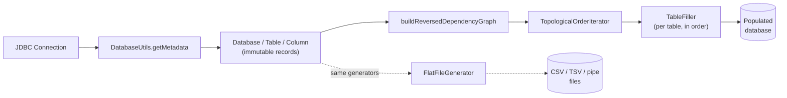
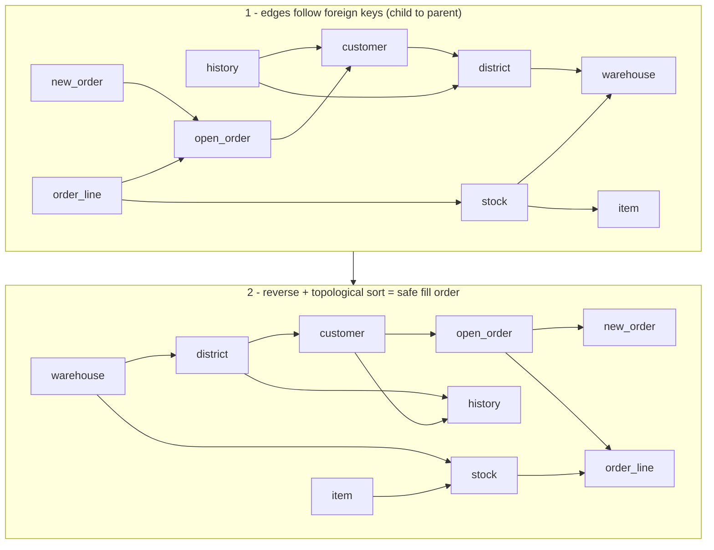
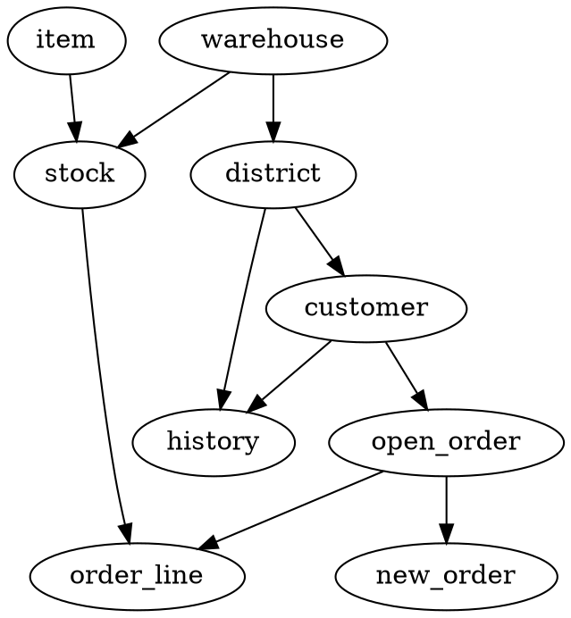
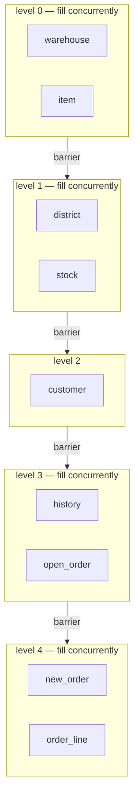
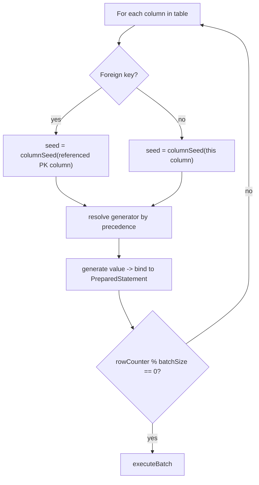
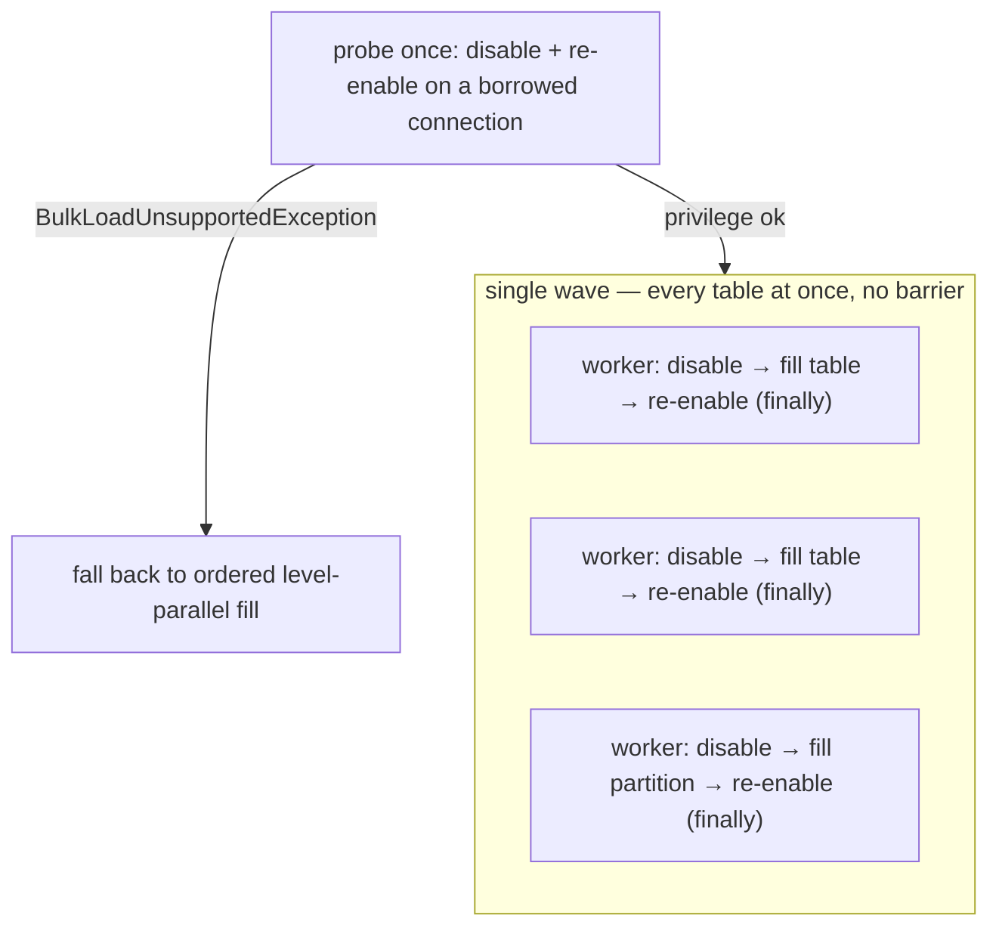
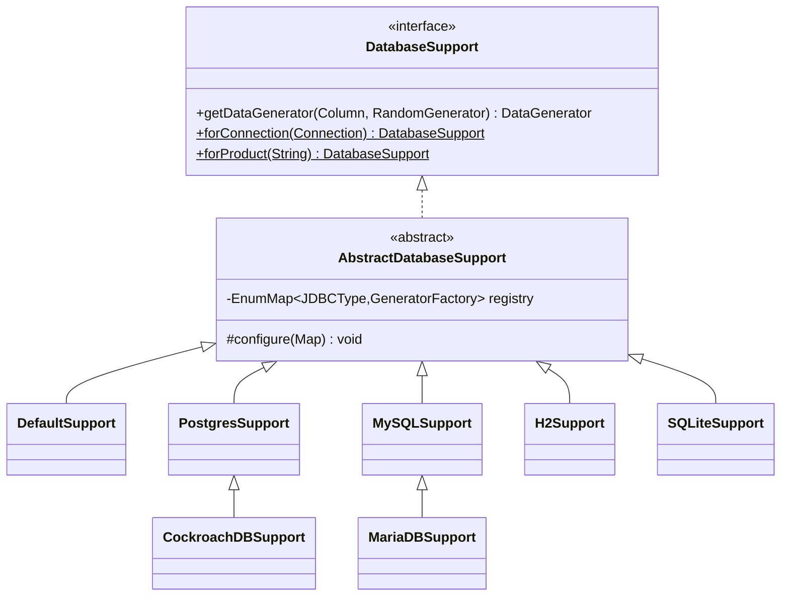
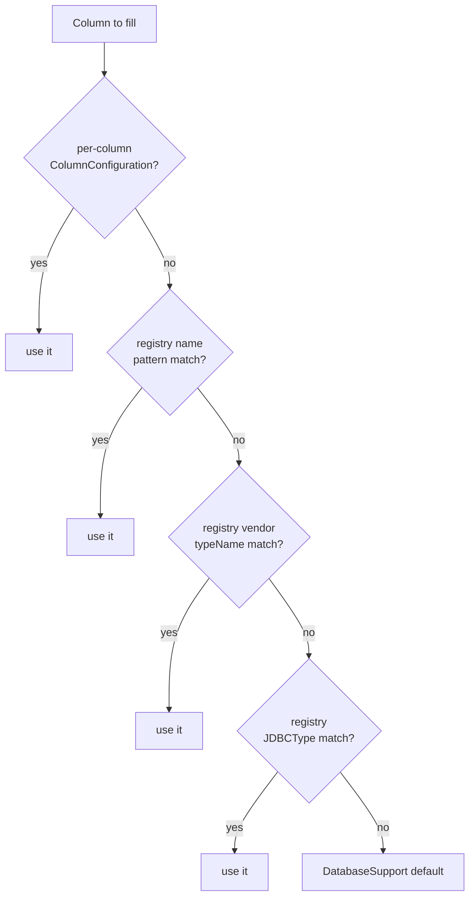
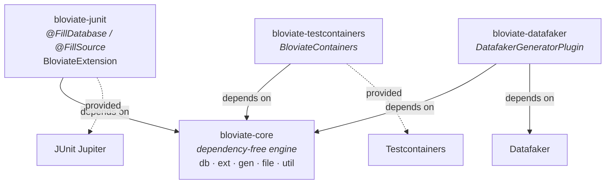

# Bloviate Architecture

This document is a technical deep-dive into **how Bloviate works** — the design decisions and the
genuinely interesting machinery behind the scenes. If you just want to *use* Bloviate, start with
the [README](/guides/quickstart/). If you want to understand it, extend it, or contribute, you're in the
right place.

> All class references below link to real code. Open paths are relative to the repository root.

## The big picture

At its core, Bloviate does something deceptively simple to describe: point it at a JDBC database,
and it fills every table with type-appropriate, constraint-respecting, reproducible data. The
interesting part is everything required to make that "just work" without you writing a single line
of generation code.

The end-to-end pipeline:



Two entry points share the same generator engine: [`DatabaseFiller`](https://github.com/timveil/bloviate/blob/main/bloviate-core/src/main/java/io/bloviate/db/DatabaseFiller.java)
(fill a live database) and [`FlatFileGenerator`](https://github.com/timveil/bloviate/blob/main/bloviate-core/src/main/java/io/bloviate/file/FlatFileGenerator.java)
(write flat files, no database required).

## Schema introspection — reading the database

Bloviate never asks you to describe your schema — it reads it. [`DatabaseUtils.getMetadata(Connection)`](https://github.com/timveil/bloviate/blob/main/bloviate-core/src/main/java/io/bloviate/util/DatabaseUtils.java)
walks the standard JDBC [`DatabaseMetaData`](https://docs.oracle.com/en/java/javase/25/docs/api/java.sql/java/sql/DatabaseMetaData.html)
API to discover tables, columns (with type, size, precision, nullability), primary keys, and
foreign keys, then assembles them into an immutable model:

| Record | Represents |
| --- | --- |
| [`Database`](https://github.com/timveil/bloviate/blob/main/bloviate-core/src/main/java/io/bloviate/db/Database.java) | Catalog + the set of tables |
| [`Table`](https://github.com/timveil/bloviate/blob/main/bloviate-core/src/main/java/io/bloviate/db/Table.java) | Columns, primary key, foreign keys, generated `INSERT` SQL |
| [`Column`](https://github.com/timveil/bloviate/blob/main/bloviate-core/src/main/java/io/bloviate/db/Column.java) | `JDBCType`, vendor `typeName`, size/precision, ordinal position |
| [`PrimaryKey`](https://github.com/timveil/bloviate/blob/main/bloviate-core/src/main/java/io/bloviate/db/PrimaryKey.java) / [`ForeignKey`](https://github.com/timveil/bloviate/blob/main/bloviate-core/src/main/java/io/bloviate/db/ForeignKey.java) | Key relationships used to build the dependency graph |

These are all Java **records** — immutable, boilerplate-free value types. The metadata model is the
single source of truth that every later stage reads from.

## The dependency DAG — fill order via topological sort

This is the headline feature. You can't insert an order row before the customer it references
exists, so Bloviate has to fill **parent tables before child tables**. It figures the order out
automatically by modeling the schema as a directed graph and topologically sorting it, using the
[JGraphT](https://jgrapht.org/) library.

[`DatabaseFiller.buildReversedDependencyGraph`](https://github.com/timveil/bloviate/blob/main/bloviate-core/src/main/java/io/bloviate/db/DatabaseFiller.java)
builds a `DefaultDirectedGraph<Table, DefaultEdge>` where each foreign key adds an edge from the
**child** table (the one holding the FK) to the **parent** table it references. It then wraps the
result in an `EdgeReversedGraph` so that a `TopologicalOrderIterator` yields parents *before* the
children that depend on them:



The fill loop is then just:

```java
TopologicalOrderIterator<Table, DefaultEdge> iterator = new TopologicalOrderIterator<>(reversedGraph);
while (iterator.hasNext()) {
    new TableFiller.Builder(connection, database, configuration)
            .table(iterator.next())
            .build().fill();
}
```

**Visualize it for free.** As a nice touch, `DatabaseFiller` exports the graph to
[Graphviz DOT](https://graphviz.org/doc/info/lang.html) notation with JGraphT's `DOTExporter`,
URL-encodes it, and logs a clickable [GraphvizOnline](https://dreampuf.github.io/GraphvizOnline/)
link so you can *see* your schema's dependency graph rendered in the browser — no tooling required.

**See it on a real schema.** Here's the graph Bloviate emits for the
[TPC-C](https://www.tpc.org/tpcc/) schema — the exact DOT its `DOTExporter` produces, rendered live
below. Each parent points to the children that depend on it, which is the order tables get filled:



That diagram is rendered straight from the DOT above.
[**Open it in GraphvizOnline →**](https://dreampuf.github.io/GraphvizOnline/#strict%20digraph%20tpcc%20%7B%0A%20%20warehouse%20%5B%20label%3D%22warehouse%22%20%5D%3B%0A%20%20item%20%5B%20label%3D%22item%22%20%5D%3B%0A%20%20stock%20%5B%20label%3D%22stock%22%20%5D%3B%0A%20%20district%20%5B%20label%3D%22district%22%20%5D%3B%0A%20%20customer%20%5B%20label%3D%22customer%22%20%5D%3B%0A%20%20history%20%5B%20label%3D%22history%22%20%5D%3B%0A%20%20open_order%20%5B%20label%3D%22open_order%22%20%5D%3B%0A%20%20new_order%20%5B%20label%3D%22new_order%22%20%5D%3B%0A%20%20order_line%20%5B%20label%3D%22order_line%22%20%5D%3B%0A%20%20warehouse%20-%3E%20stock%3B%0A%20%20item%20-%3E%20stock%3B%0A%20%20warehouse%20-%3E%20district%3B%0A%20%20district%20-%3E%20customer%3B%0A%20%20district%20-%3E%20history%3B%0A%20%20customer%20-%3E%20history%3B%0A%20%20customer%20-%3E%20open_order%3B%0A%20%20open_order%20-%3E%20new_order%3B%0A%20%20open_order%20-%3E%20order_line%3B%0A%20%20stock%20-%3E%20order_line%3B%0A%7D%0A)
— the very link `DatabaseFiller` logs at fill time, where you can pan, zoom, and edit the DOT yourself.

**Cycle handling.** Self-referencing foreign keys (a table pointing at itself) can't be topologically
ordered cleanly, so they're detected and logged with a warning rather than silently producing broken
data.

### Parallel fill — topological levels

The loop above is sequential and runs on a single `Connection` — the default, and the only option
when you hand `DatabaseFiller` a `Connection`. Construct it from a pooled `DataSource` instead and
call `threads(n)`, and the fill runs **in parallel**.

The key insight: tables in the *same* topological "level" have no foreign key between them, so they
can fill concurrently. [`DatabaseFiller.fillLevels`](https://github.com/timveil/bloviate/blob/main/bloviate-core/src/main/java/io/bloviate/db/DatabaseFiller.java)
groups the graph into levels with Kahn's algorithm — level 0 is every table that references nothing,
level 1 the tables whose parents are all in level 0, and so on:



Each table is filled by a worker that borrows its own `Connection` from the pool (JDBC connections
are not thread-safe) inside its own transaction, and a **barrier** between levels guarantees a child
table never starts before its parents are committed. The fill stays **fully reproducible**: a table's
data depends only on its own per-column seeds and row order, never on which tables fill alongside it,
so for the same seed a parallel fill yields the same row content as a sequential one across every
deterministic column — physical row order and wall-clock columns aside
([reproducible seeds](#reproducibility--deterministic-seeds-from-schema-identity)). The win is largest for wide
schemas of independent tables and small for deep, narrow FK chains (little fans out within a level).

## Filling a table — generators, batching, and FK fidelity

[`TableFiller`](https://github.com/timveil/bloviate/blob/main/bloviate-core/src/main/java/io/bloviate/db/TableFiller.java) handles one table. For
each column it resolves a [`DataGenerator`](https://github.com/timveil/bloviate/blob/main/bloviate-core/src/main/java/io/bloviate/gen/DataGenerator.java),
then loops `rowCount` times generating values and binding them to a `PreparedStatement`.

**Batch inserts.** Rows are accumulated with `addBatch()` and flushed with `executeBatch()` every
`batchSize` rows (default 1000), with a final flush for the remainder — keeping inserts efficient on
large datasets.

**Foreign-key fidelity.** This is subtle and clever. When a column is a foreign key, Bloviate seeds
its generator from the *referenced primary key column's* seed (see [reproducibility](#reproducibility--deterministic-seeds-from-schema-identity)),
so the FK generator reproduces exactly the same value sequence the parent table's PK generator
produced — the values line up by construction. To avoid generating FK values that point at
nonexistent parent rows, a `maxInvocationMap` caps how many distinct values an FK generator emits
(the parent table's row count) and **reseeds** the generator when that boundary is hit, cycling it
back through the same valid value range.



The inner loop is the hot path (it runs `rowCount × columnCount` times), so `TableFiller` resolves
every column's generator, seed, and FK reseed-threshold *once* into positional arrays indexed by
column ordinal — the loop then does array reads instead of hashing the `Column` on every cell.

### Commit strategy

By default the engine leaves the connection's autocommit state untouched — an autocommit connection
commits per `executeBatch()`. A [`CommitStrategy`](https://github.com/timveil/bloviate/blob/main/bloviate-core/src/main/java/io/bloviate/db/CommitStrategy.java)
on `DatabaseConfiguration` lets you cut that overhead: `perTable()` disables autocommit and commits
once when the table is filled, and `everyNBatches(n)` commits every *n* batches to bound the open
transaction. When a strategy is set, `TableFiller` owns the transaction (autocommit off, commit at the
configured cadence, rollback on error, prior autocommit restored afterward); the default
`connectionDefault()` preserves the original behavior. The parallel path's per-table commit is the
same mechanism — its workers run with an effective `perTable()` strategy.

### Intra-table partitioning — seeking to a row range

Parallel fill ([topological levels](#parallel-fill--topological-levels)) parallelizes *across* tables, which doesn't
help when a single huge table dominates — it fills alone in its level. Set `partitions` on that
table's `TableConfiguration` and, on the parallel path, `DatabaseFiller` splits its `[0, rowCount)`
rows into that many contiguous ranges filled concurrently, one `Connection` per range.

The challenge is reproducibility: a worker starting at absolute row *N* must produce the value the
sequential fill produces at row *N*, without replaying rows `0..N`. Counter/cursor generators solve
this with [`IndexedDataGenerator`](https://github.com/timveil/bloviate/blob/main/bloviate-core/src/main/java/io/bloviate/gen/IndexedDataGenerator.java),
whose `seek(rowIndex)` positions the generator directly (the composite/sequence/permutation generators
are closed-form O(1); the variable-cardinality child-key generator locates the owning parent via the
`ChildCardinality` cumulative). `TableFiller` seeks each column at the partition's first row with a
three-way policy:

| Column kind | Seek behavior | Result vs. sequential |
| --- | --- | --- |
| Positional (`IndexedDataGenerator` — keys, sequences, permutations, prefixes) | `seek(start)` | **byte-identical** |
| Foreign-key random-replay (`maxInvocation > 0`) | reseed, then advance `start % maxInvocation` draws into the parent cycle | **byte-identical** (FK-valid) |
| Plain non-key random | reseed from a partition-derived seed | deterministic per partition count |

Because every column that participates in a cross-row or cross-table contract (keys and foreign keys)
stays byte-identical, **foreign-key validity always holds** and the fill is reproducible *for a given
configuration, including the partition count*. Only plain non-key random columns — which carry no such
contract — take different values when you change the partition count. The default (unpartitioned) path
never seeks and is byte-for-byte unchanged, so there is no per-cell cost for the common case. One edge
is unsupported: partitioning a *parent* whose primary key is a plain random generator referenced by a
foreign key (partition the child instead, or use the positional key generators). A custom generator
with internal positional state must implement `IndexedDataGenerator` to stay aligned under partitioning.

### Bulk load — unordered fill with constraints disabled

[Parallel fill](#parallel-fill--topological-levels) barriers between topological levels, which costs
the most on a **deep, narrow** foreign-key chain: each level holds few tables, so little fans out and
the fill effectively serializes down the chain.
[`BulkLoadStrategy.unorderedBulk()`](https://github.com/timveil/bloviate/blob/main/bloviate-core/src/main/java/io/bloviate/db/BulkLoadStrategy.java)
collapses every level into a single wave — one task per table (or partition), submitted at once with
no barrier — and disables foreign-key enforcement for the duration.

This is only sound because of [foreign-key fidelity](#filling-a-table--generators-batching-and-fk-fidelity):
an FK column is seeded from its referenced PK column, so the data is referentially consistent
*regardless of insert order*. Disabling enforcement removes the per-row check and the ordering
requirement without changing a single generated value — so for the same seed the result has the same
row content as an ordered fill across every deterministic column (physical row order aside).



The mechanism is database-specific and lives behind two
[`DatabaseSupport`](https://github.com/timveil/bloviate/blob/main/bloviate-core/src/main/java/io/bloviate/ext/DatabaseSupport.java)
SPI methods, `disableConstraints` / `enableConstraints`, guarded by `supportsBulkLoad()`:

| Support | Mechanism (per session) | Notes |
| --- | --- | --- |
| PostgreSQL | `SET session_replication_role = replica` → `origin` | needs a superuser/`rds_superuser` role; privilege failure raises `BulkLoadUnsupportedException` |
| MySQL | `SET FOREIGN_KEY_CHECKS=0`/`UNIQUE_CHECKS=0` → `1` | no special privilege |
| CockroachDB | unsupported (`supportsBulkLoad()` is `false`) | no `session_replication_role`; falls back to ordered |

Because these settings are **per connection** and each worker borrows its own from the pool, the
disable/enable runs inside every worker task, wrapped in a `try/finally` that restores the session
*before* the connection returns to the pool — so a constraint-disabled connection never leaks to
other pool users, even if a fill throws. Privilege is probed **once** up front on a throwaway
connection; if it fails, the engine logs a warning and runs the ordered level-parallel path instead
of fanning out half-disabled. Bulk mode only applies to the `DataSource` + `threads > 1` path; it is
ignored with a warning elsewhere. The default `BulkLoadStrategy.ordered()` keeps the dependency-ordered
behavior with constraints always enforced.

## Reproducibility — deterministic seeds from schema identity

Bloviate datasets are **reproducible across JVM runs, machines, and time** — run it twice against
the same schema with the same base seed and you get byte-for-byte identical data. This is not done
by seeding one global `Random`; it's done *per column*.

[`DatabaseUtils.columnSeed(Column, baseSeed)`](https://github.com/timveil/bloviate/blob/main/bloviate-core/src/main/java/io/bloviate/util/DatabaseUtils.java)
derives a stable seed by hashing the column's **identity** — its name, table, schema, catalog, JDBC
type name, and ordinal position — and mixing it with the base seed:

```java
int identity = Objects.hash(
        column.name(), column.tableName(), column.schema(), column.catalog(),
        column.jdbcType() == null ? null : column.jdbcType().getName(),
        column.ordinalPosition());
return baseSeed * 1_000_003L + identity;
```

Two important properties fall out of this design:

- **Run-independence.** The seed depends only on schema identity, never on iteration order, hash-map
  ordering, or wall-clock time. The JDBC type's *name* is hashed (not the enum's `ordinal()`), so the
  seed is stable even if the enum changes.
- **FK alignment for free.** Because the seed is a pure function of the column, a foreign key column
  and the primary key it references resolve to the *same* seed — which is exactly what makes the
  FK-fidelity trick in [the table-fill section](#filling-a-table--generators-batching-and-fk-fidelity) work.

Every generator — built-in, registry-supplied, or per-column override — is constructed with this
engine-managed seed, so reproducibility holds no matter how a column's generator was chosen.

The per-column seed feeds a [`java.util.random.RandomGenerator`](https://docs.oracle.com/en/java/javase/25/docs/api/java.base/java/util/random/package-summary.html)
created by [`RandomGenerators.create(seed)`](https://github.com/timveil/bloviate/blob/main/bloviate-core/src/main/java/io/bloviate/util/RandomGenerators.java),
which uses the JDK general-purpose default algorithm **`L64X128MixRandom`** rather than the legacy
`java.util.Random` (a 48-bit LCG with a documented statistical defect and `synchronized` methods).
The seeding architecture is unchanged — one isolated, deterministically-seeded generator per column —
so output stays reproducible and order-independent; only the algorithm and statistical quality improve.

Because a value depends only on its column's seed and row index — never on timing or which tables fill
alongside it — reproducibility survives concurrency. A **parallel table fill**
([parallel fill](#parallel-fill--topological-levels)) yields the same row content as a sequential one across every deterministic column. An
**intra-table partitioned fill** ([intra-table partitioning](#intra-table-partitioning--seeking-to-a-row-range)) is
reproducible for a given configuration *including the partition count*: keys and foreign keys are
byte-identical regardless of partitioning, and only plain non-key random columns vary with it.

## Database support — the Strategy pattern

Different databases expose different types. [`DatabaseSupport`](https://github.com/timveil/bloviate/blob/main/bloviate-core/src/main/java/io/bloviate/ext/DatabaseSupport.java)
is the strategy interface that maps a `Column` to a generator; [`AbstractDatabaseSupport`](https://github.com/timveil/bloviate/blob/main/bloviate-core/src/main/java/io/bloviate/ext/AbstractDatabaseSupport.java)
holds an `EnumMap<JDBCType, GeneratorFactory>` of cross-database defaults and exposes a `configure()`
hook that subclasses override to add or replace entries for vendor-specific types.



| Implementation | Adds on top of the JDBC defaults |
| --- | --- |
| [`DefaultSupport`](https://github.com/timveil/bloviate/blob/main/bloviate-core/src/main/java/io/bloviate/ext/DefaultSupport.java) | Nothing — cross-database JDBC types only |
| [`PostgresSupport`](https://github.com/timveil/bloviate/blob/main/bloviate-core/src/main/java/io/bloviate/ext/PostgresSupport.java) | `uuid`, `json`/`jsonb`, `inet`, `cidr`, `macaddr`/`macaddr8`, `interval`, `bit`/`varbit`, `xml`, and `text`/`int` arrays |
| [`MySQLSupport`](https://github.com/timveil/bloviate/blob/main/bloviate-core/src/main/java/io/bloviate/ext/MySQLSupport.java) | `JSON` columns generate valid JSON instead of arbitrary text |
| [`MariaDBSupport`](https://github.com/timveil/bloviate/blob/main/bloviate-core/src/main/java/io/bloviate/ext/MariaDBSupport.java) | Extends `MySQLSupport` — MariaDB columns surface through JDBC essentially as MySQL's |
| [`CockroachDBSupport`](https://github.com/timveil/bloviate/blob/main/bloviate-core/src/main/java/io/bloviate/ext/CockroachDBSupport.java) | Extends `PostgresSupport` (CockroachDB is PG wire-compatible) |
| [`H2Support`](https://github.com/timveil/bloviate/blob/main/bloviate-core/src/main/java/io/bloviate/ext/H2Support.java) | Signed `TINYINT` (`-128..127`), `UUID` (reported as `BINARY`), and valid `JSON` |
| [`SQLiteSupport`](https://github.com/timveil/bloviate/blob/main/bloviate-core/src/main/java/io/bloviate/ext/SQLiteSupport.java) | Nothing — SQLite's affinity types collapse onto `INTEGER`/`FLOAT`/`VARCHAR`, already covered by the defaults |

You don't have to pick manually. `DatabaseSupport.forConnection(connection)` reads
`DatabaseMetaData.getDatabaseProductName()` and selects the right strategy by substring match,
falling back to `DefaultSupport`. (Note: CockroachDB reached via the PG driver reports as
`PostgreSQL` and resolves to `PostgresSupport` — equivalent, since `CockroachDBSupport` adds no extra
behavior.)

`DatabaseSupport` also reads **value constraints** for a table — `DatabaseSupport.readConstraints(...)`.
The default is none; `PostgresSupport` queries `pg_constraint`/`pg_enum`, parses the common `CHECK`
forms (`IN`, `BETWEEN`, comparisons) and enum labels into a `ColumnConstraint`, and `TableFiller` then
prefers a constraint-satisfying generator (categorical or bounded numeric) over the type default —
so generated values conform instead of being rejected. Forms that can't be honored are logged and
skipped.

## Pluggable generators — Registry + ServiceLoader

Sometimes the type-based default isn't what you want — you want every column named `email` to look
like an email, regardless of its SQL type. The [`GeneratorRegistry`](https://github.com/timveil/bloviate/blob/main/bloviate-core/src/main/java/io/bloviate/ext/GeneratorRegistry.java)
lets you override generation **without subclassing `DatabaseSupport`**, and external jars can
contribute rules automatically via Java's [`ServiceLoader`](https://docs.oracle.com/en/java/javase/25/docs/api/java.base/java/util/ServiceLoader.html).

A registry supports three matcher kinds, and the fill engine resolves each column through a fixed
precedence chain:



Plugins implement the single-method [`GeneratorPlugin`](https://github.com/timveil/bloviate/blob/main/bloviate-core/src/main/java/io/bloviate/ext/GeneratorPlugin.java)
SPI and declare themselves in `META-INF/services/io.bloviate.ext.GeneratorPlugin`. Calling
`GeneratorRegistry.Builder.discover()` loads every plugin on the classpath:

```java
GeneratorRegistry registry = new GeneratorRegistry.Builder()
        .registerColumnNamePattern(".*email", (column, random) -> new EmailGenerator.Builder(random).build())
        .registerTypeName("uuid", (column, random) -> new UUIDGenerator.Builder(random).build())
        .discover() // pick up GeneratorPlugin services from the classpath
        .build();
```

Crucially, registry- and plugin-supplied generators are still constructed with the engine's seeded
`RandomGenerator`, so they remain just as reproducible as the built-ins. The optional
**[`bloviate-datafaker`](https://github.com/timveil/bloviate/tree/main/bloviate-datafaker/)** module is exactly this pattern in practice: one
`GeneratorPlugin` that maps column names (`email`, `first_name`, `phone`, …) to realistic
[Datafaker](https://www.datafaker.net/) values, seeded from the engine's column seed for
reproducibility — keeping the core dependency-free. It also offers **referential realism** via a
`RowContext`: correlated columns project fields of one per-row entity — a `Person` whose email/username
derive from its name, or a `Geo` tuple (city/state/zip/area-code that agree) drawn from a bundled
reference dataset — computed as a pure function of `(seed, rowIndex)` so consistency survives parallel
and partitioned fills.

## The generator library — Builder pattern

Every generator implements [`DataGenerator<T>`](https://github.com/timveil/bloviate/blob/main/bloviate-core/src/main/java/io/bloviate/gen/DataGenerator.java),
which can `generate()` a typed value, `generateAsString()` for flat files, bind itself to a
`PreparedStatement` (`generateAndSet`), and read a value back from a `ResultSet` (`get`). Each is
constructed through a static inner `Builder` seeded with a `RandomGenerator`:

```java
new SimpleStringGenerator.Builder(random).size(100).build();
new BigDecimalGenerator.Builder(random).precision(10).digits(2).build();
```

The library ships ~50 generators in [`io.bloviate.gen`](https://github.com/timveil/bloviate/tree/main/bloviate-core/src/main/java/io/bloviate/gen/),
covering everything from primitives and dates to `uuid`, `jsonb`, `inet`/`cidr`, MAC addresses,
intervals, arrays, and XML. A few are worth calling out:

- **Referential-fidelity generators** — `CompositeKeyComponentGenerator`, `ChildKeyComponentGenerator`,
  and `ChildCountGenerator` produce collision-free composite keys and variable parent/child
  cardinalities that keep foreign keys consistent.
- **`GroupedPermutationGenerator`** — emits a deterministic permutation *per group* (e.g. TPC-C's
  shuffled `o_c_id`) using a **Feistel network with cycle-walking**, achieving a unique pseudo-random
  permutation in O(1) memory without materializing or shuffling an array.
- **TPC-C generators** — [`io.bloviate.gen.tpcc`](https://github.com/timveil/bloviate/tree/main/bloviate-core/src/main/java/io/bloviate/gen/tpcc/)
  provides benchmark-faithful fields (customer last names, zip codes, credit, delivery dates).
- **Distribution generators** — `WeightedCategoricalGenerator`, `NormalDoubleGenerator`/`NormalIntegerGenerator`,
  `ZipfianIntegerGenerator`, and `SkewedTimestampGenerator` emit non-uniform values (categorical,
  bounded-Gaussian, power-law, recency-skewed). A column opts in through the
  [`Distributions`](https://github.com/timveil/bloviate/blob/main/bloviate-core/src/main/java/io/bloviate/db/Distributions.java) convenience without
  writing a factory. These are *specified* distributions, not learned from data — so they stay
  deterministic by seed and compose with FK reseeding and parallel fills like any other generator.

## Flat-file generation

The same generators power [`FlatFileGenerator`](https://github.com/timveil/bloviate/blob/main/bloviate-core/src/main/java/io/bloviate/file/FlatFileGenerator.java),
which needs no database at all. You describe columns with [`ColumnDefinition`](https://github.com/timveil/bloviate/blob/main/bloviate-core/src/main/java/io/bloviate/file/ColumnDefinition.java)
(name + generator), pick a [`FileType`](https://github.com/timveil/bloviate/blob/main/bloviate-core/src/main/java/io/bloviate/file/FileType.java)
(`CSV`, `TDV`, or `PIPE`), and `generate()`. Output is written via
[Apache Commons CSV](https://commons.apache.org/proper/commons-csv/), with headers derived from
column names:

```java
new FlatFileGenerator.Builder("output/users")
        .add(new ColumnDefinition("id", new IntegerGenerator.Builder(random).build()))
        .add(new ColumnDefinition("email", new SimpleStringGenerator.Builder(random).build()))
        .rows(1000)
        .build()
        .generate();
```

## Multi-module layout

Bloviate is a Maven reactor. The engine is dependency-free; the integration modules pull in their
framework as a **`provided`** dependency so you bring your own version.



- **[`bloviate-core`](https://github.com/timveil/bloviate/tree/main/bloviate-core/)** — everything above: introspection, the DAG, generators,
  database support, flat files.
- **[`bloviate-junit`](https://github.com/timveil/bloviate/tree/main/bloviate-junit/)** — declarative test-data filling. Annotate a test (class or
  method) with [`@FillDatabase`](https://github.com/timveil/bloviate/blob/main/bloviate-junit/src/main/java/io/bloviate/junit/FillDatabase.java)
  and mark a `DataSource`/`Connection` field with [`@FillSource`](https://github.com/timveil/bloviate/blob/main/bloviate-junit/src/main/java/io/bloviate/junit/FillSource.java);
  [`BloviateExtension`](https://github.com/timveil/bloviate/blob/main/bloviate-junit/src/main/java/io/bloviate/junit/BloviateExtension.java) (a
  JUnit `BeforeEachCallback`) auto-detects the right `DatabaseSupport` and fills before each test.
- **[`bloviate-testcontainers`](https://github.com/timveil/bloviate/tree/main/bloviate-testcontainers/)** — fill a started
  `JdbcDatabaseContainer` in one fluent call via
  [`BloviateContainers.forContainer(...)`](https://github.com/timveil/bloviate/blob/main/bloviate-testcontainers/src/main/java/io/bloviate/testcontainers/BloviateContainers.java).
- **[`bloviate-datafaker`](https://github.com/timveil/bloviate/tree/main/bloviate-datafaker/)** — optional semantic/realistic values by column name,
  via a `GeneratorPlugin` over [Datafaker](https://www.datafaker.net/). Unlike the others, Datafaker is
  a normal (not `provided`) dependency — it only reaches your classpath if you add this module.

## Design patterns at a glance

Bloviate leans deliberately on a small, well-understood set of design patterns. They aren't applied
for their own sake — each one buys a concrete property (extensibility, immutability, testability)
and they compose cleanly. If you've read the Gang of Four, this table is a fast map of where each
pattern lives and what it's doing for us.

| Pattern | Where it lives | What it buys |
| --- | --- | --- |
| **Builder** | Nearly everything: [`DatabaseFiller.Builder`](https://github.com/timveil/bloviate/blob/main/bloviate-core/src/main/java/io/bloviate/db/DatabaseFiller.java), [`TableFiller.Builder`](https://github.com/timveil/bloviate/blob/main/bloviate-core/src/main/java/io/bloviate/db/TableFiller.java), every `*Generator.Builder`, [`GeneratorRegistry.Builder`](https://github.com/timveil/bloviate/blob/main/bloviate-core/src/main/java/io/bloviate/ext/GeneratorRegistry.java), [`FlatFileGenerator.Builder`](https://github.com/timveil/bloviate/blob/main/bloviate-core/src/main/java/io/bloviate/file/FlatFileGenerator.java), [`BloviateContainers.Builder`](https://github.com/timveil/bloviate/blob/main/bloviate-testcontainers/src/main/java/io/bloviate/testcontainers/BloviateContainers.java) | Readable construction of objects with many optional, defaulted parameters; immutable results with no telescoping constructors |
| **Strategy** | [`DatabaseSupport`](https://github.com/timveil/bloviate/blob/main/bloviate-core/src/main/java/io/bloviate/ext/DatabaseSupport.java) + per-database implementations | Database-specific behavior is swappable at runtime; adding a database means adding a class, not editing the engine |
| **Template Method** | [`AbstractDatabaseSupport`](https://github.com/timveil/bloviate/blob/main/bloviate-core/src/main/java/io/bloviate/ext/AbstractDatabaseSupport.java) seeds defaults, then calls the `configure()` hook | Subclasses customize *only* the vendor-specific slice; the invariant default registry is defined once |
| **Factory** (functional) | [`GeneratorFactory`](https://github.com/timveil/bloviate/blob/main/bloviate-core/src/main/java/io/bloviate/ext/GeneratorFactory.java), [`ColumnGeneratorFactory`](https://github.com/timveil/bloviate/blob/main/bloviate-core/src/main/java/io/bloviate/db/ColumnGeneratorFactory.java) | Defers generator creation until the engine can supply a column-seeded `RandomGenerator`, preserving reproducibility |
| **Registry** | [`GeneratorRegistry`](https://github.com/timveil/bloviate/blob/main/bloviate-core/src/main/java/io/bloviate/ext/GeneratorRegistry.java) with documented precedence | Override generation by name/type without subclassing; rules resolved in a fixed, predictable order |
| **Service Provider (SPI)** | [`GeneratorPlugin`](https://github.com/timveil/bloviate/blob/main/bloviate-core/src/main/java/io/bloviate/ext/GeneratorPlugin.java) via `ServiceLoader` | Third-party jars contribute generators by dropping a file on the classpath — zero engine coupling |
| **Strategy / polymorphism** | The [`DataGenerator<T>`](https://github.com/timveil/bloviate/blob/main/bloviate-core/src/main/java/io/bloviate/gen/DataGenerator.java) hierarchy; [`CommitStrategy`](https://github.com/timveil/bloviate/blob/main/bloviate-core/src/main/java/io/bloviate/db/CommitStrategy.java) for transaction cadence | One uniform interface (`generate` / bind / read-back) over ~50 type-specific implementations; swappable commit behavior |
| **Seekable cursor** | [`IndexedDataGenerator.seek(long)`](https://github.com/timveil/bloviate/blob/main/bloviate-core/src/main/java/io/bloviate/gen/IndexedDataGenerator.java) on the positional generators | Position a generator at an absolute row index without replaying — the basis for intra-table partitioning |
| **Iterator** | JGraphT's `TopologicalOrderIterator` in [`DatabaseFiller`](https://github.com/timveil/bloviate/blob/main/bloviate-core/src/main/java/io/bloviate/db/DatabaseFiller.java) | Fill order is expressed as a traversal, decoupled from graph construction |
| **Adapter** | [`bloviate-junit`](https://github.com/timveil/bloviate/tree/main/bloviate-junit/) and [`bloviate-testcontainers`](https://github.com/timveil/bloviate/tree/main/bloviate-testcontainers/) | Wrap the same core engine behind framework-native front-ends (`@FillDatabase`, `BloviateContainers`) |

The payoff is that the two extension axes you actually care about — **"support a new database"** and
**"generate a new kind of value"** — are both open for extension without modifying a line of the
core engine (Open/Closed Principle). Strategy handles the first; Registry + SPI handle the second.

## Design principles

A few themes recur throughout the codebase and explain most of the "why" — they're the result of
deliberate design effort, not incidental:

1. **Read, don't configure.** Schema is introspected from JDBC metadata, not hand-described.
2. **Immutability.** The metadata and configuration models are Java records; registries are built
   once and copied defensively.
3. **Determinism by construction.** Seeds derive from schema identity, never runtime state — so data
   is reproducible and foreign keys align without bookkeeping.
4. **Open for extension, closed for modification.** The Strategy pattern (`DatabaseSupport`) handles
   new databases; the Registry + ServiceLoader (`GeneratorPlugin`) handles new generation rules —
   neither requires touching the engine.
5. **One engine, many front-ends.** Database filling, flat files, JUnit, and Testcontainers all sit
   on the same `bloviate-core` generators.

### What this buys in practice

These principles aren't abstract — they show up as concrete quality properties you can rely on:

- **A dependency-free core.** `bloviate-core` keeps its dependency surface small and pushes JUnit and
  Testcontainers to `provided` scope, so integrating Bloviate doesn't drag a testing framework into
  your runtime classpath, and you bring your own versions.
- **Tested against real databases.** Integration tests run against actual PostgreSQL, MySQL, MariaDB,
  and CockroachDB instances via Testcontainers — plus embedded H2 and SQLite — not mocks — over real benchmark schemas (TPC-C,
  AuctionMark, Wikipedia). Behavior is verified end-to-end, including the FK ordering and round-trip
  read-back through each generator's `get(ResultSet, ...)`.
- **Reproducibility as a guarantee, not a hope.** Because seeds are pure functions of schema identity,
  "it worked on my machine" datasets are byte-for-byte portable — which is exactly what you want from
  test fixtures and benchmark data.
- **Modern Java, used deliberately.** Records for the immutable model, sealed extension points,
  functional SPIs (`@FunctionalInterface`), and `EnumMap`-backed registries reflect a codebase built
  on Java 25 idioms rather than retrofitted onto them.
- **Thorough documentation.** The public types carry real Javadoc — including the *precedence rules*
  for generator resolution and the CockroachDB/PostgreSQL driver caveat — so the contracts are
  written down, not folklore.

The throughline: Bloviate is a small library that takes its own design seriously. The patterns and
principles above are what let it stay simple to *use* while remaining genuinely extensible underneath.

---

*See also: [Quick Start](./QUICKSTART.md) to start filling databases.*
