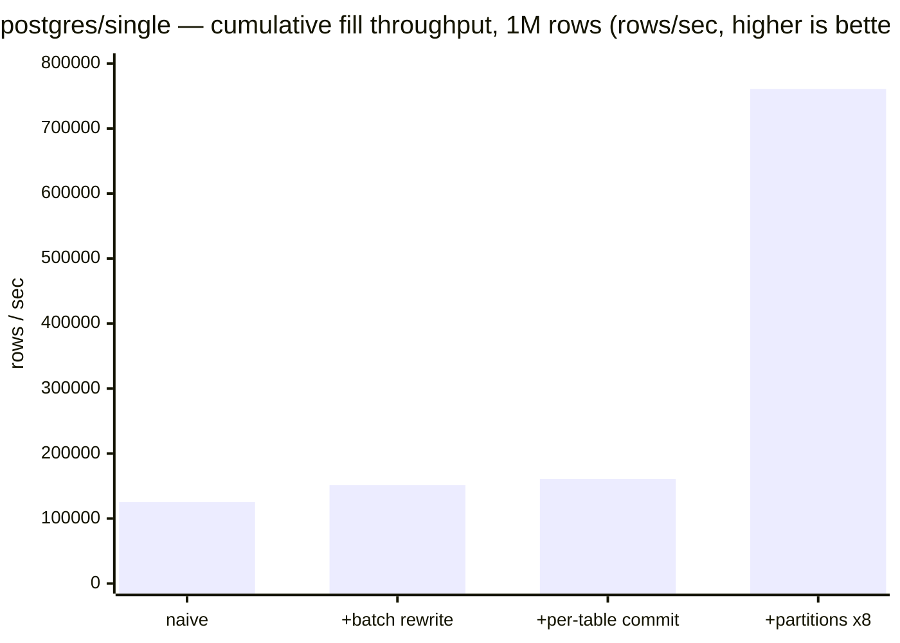
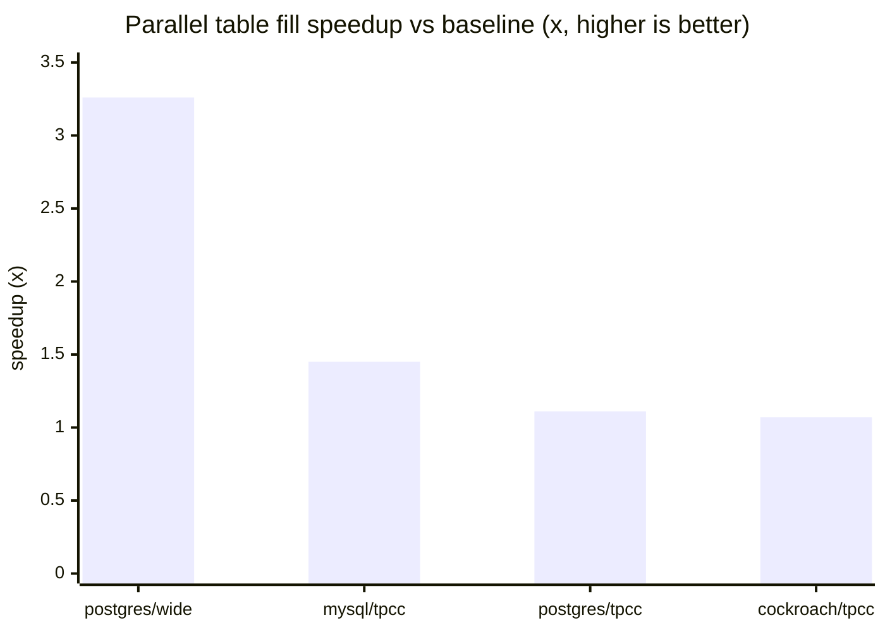
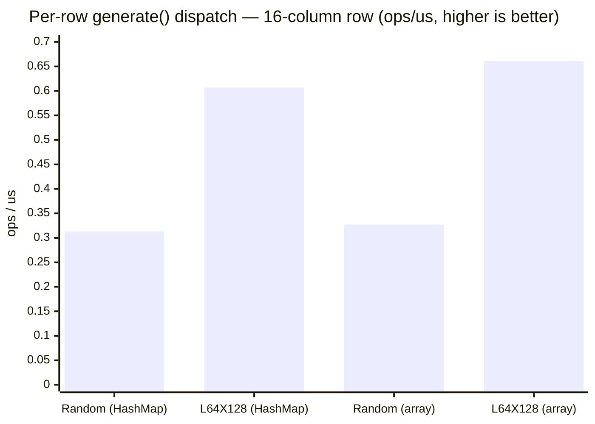

# Benchmarks

Bloviate ships with two complementary performance suites: CPU micro-benchmarks that
measure raw value generation in isolation (via [JMH](https://github.com/openjdk/jmh)), and
end-to-end fills that time `DatabaseFiller.fill()` against real databases running in
containers. The CPU suite isolates the cost of generating values and dispatching them
per cell; the end-to-end suite captures everything a real run pays for — metadata fetch,
generation, batching, and JDBC round-trips. Every number on this page is reproducible:
the benchmarks live in the (never-published) `bloviate-benchmarks` module, use fixed seeds
so each iteration generates identical data, and record the exact hardware, JDK, and database
image they were measured on.

## Two benchmark suites

The work being optimized spans two regimes, so there are two suites:

| Suite | What it measures | Where the wins show up | Tool |
|-------|------------------|------------------------|------|
| **CPU micro-benchmarks** | raw value generation and per-cell generator dispatch, no database | hot-loop micro-opts, generator-level changes | JMH |
| **End-to-end fill** | `DatabaseFiller.fill()` throughput (rows/sec) against a real DB | parallel table fill, commit tuning, batch rewrite | plain JUnit runner |

The `bloviate-benchmarks` module is never published (deploy, install, source, javadoc and
JaCoCo are all skipped) and nothing in `bloviate-core` depends on it.

## CPU micro-benchmarks (JMH)

Pure-CPU, no Docker. The benchmarks resolve generators exactly the way `TableFiller` does
(`DatabaseSupport.getDataGenerator(column, random)`), so the numbers reflect real engine cost.

- `GeneratorBenchmark` — throughput of `generate()` / `generateAsString()` across a spread of
  column types (int, numeric, varchar, timestamp, uuid, jsonb, …).
- `RowDispatchBenchmark` — models the inner loop of `TableFiller.fill()`: the per-cell
  `generatorMap.get(column)` HashMap lookup plus `generate()` over a wide row. This is the
  baseline for the "index generators by array position" change.

Build the runnable uber-jar and run it:

```bash
./mvnw -q -DskipTests -pl bloviate-benchmarks -am package
java -jar bloviate-benchmarks/target/benchmarks.jar
```

Useful invocations (standard JMH CLI — flags take a space):

```bash
# one benchmark, quick
java -jar bloviate-benchmarks/target/benchmarks.jar RowDispatchBenchmark

# restrict GeneratorBenchmark to specific column types
java -jar bloviate-benchmarks/target/benchmarks.jar GeneratorBenchmark.generate \
    -p genCase=UUID,VARCHAR_SHORT

# fewer forks/iterations while iterating locally
java -jar bloviate-benchmarks/target/benchmarks.jar -f 1 -wi 2 -i 3
```

## End-to-end fill (real database)

Opt-in JUnit runners tagged `@Tag("benchmark")`, one per database, reusing the same
TestContainers stack as the core tests. They are **skipped by a normal build** and only run
under the `bench` profile. Requires Docker (OrbStack works).

Each measured iteration truncates the schema, times a full `DatabaseFiller.fill()` (metadata
fetch included), and prints `rows/sec`. A fixed seed makes every iteration generate identical
data, so timings are comparable across runs and across optimization branches.

- `PostgresFillBenchmark` — TPC-C schema, a deliberately wide FK-free schema
  (`create_wide.postgres.sql`, the between-table parallel-fill target), **and** a single dominant
  table (`create_single.postgres.sql`, the intra-table partitioning target).
- `MySqlFillBenchmark`, `CockroachFillBenchmark` — TPC-C schema.

```bash
# all end-to-end benchmarks (Postgres + MySQL + CockroachDB)
./mvnw -pl bloviate-benchmarks -am -Pbench test

# just Postgres, just the wide schema, larger dataset
./mvnw -pl bloviate-benchmarks -am -Pbench test \
    -Dtest='PostgresFillBenchmark#wide' -Dbench.rows=500000

# intra-table partitioning: one big table, sequential baseline vs 8-way partitioned
./mvnw -pl bloviate-benchmarks -am -Pbench test \
    -Dtest='PostgresFillBenchmark#singleTable' -Dbench.rows=2000000 -Dbench.threads=1
./mvnw -pl bloviate-benchmarks -am -Pbench test \
    -Dtest='PostgresFillBenchmark#singleTable' -Dbench.rows=2000000 -Dbench.threads=8
```

Output lines look like:

```
[bench] postgres/wide    iteration 1        500,000 rows     3.612 s         138,430 rows/s
[bench] postgres/wide    best               500,000 rows     3.580 s         139,664 rows/s
[bench] postgres/wide    mean               500,000 rows     3.601 s         138,850 rows/s
```

### Tuning (system properties)

| Property | Default | Meaning |
|----------|--------:|---------|
| `bench.warmup` | 1 | untimed warmup fills (JIT / pool / cache priming) |
| `bench.iterations` | 3 | timed fills; best and mean are reported |
| `bench.batch` | 1000 | JDBC batch size (`DatabaseConfiguration.batchSize`) |
| `bench.threads` | 1 | worker threads; `1` = sequential baseline, `>1` = parallel `DataSource` path |
| `bench.partitions` | `max(2, threads)` | intra-table partitions for the **single** schema |
| `bench.rewriteBatched` | `true` | Postgres driver batch rewrite; set `false` for the naive baseline |
| `bench.commit` | `none` | commit strategy for **single**: `none`, `perTable`, or `everyN:K` |
| `bench.rows` | 50000 | default row count for the **wide**/**single** schema (per table) |
| `bench.warehouses` | 1 | TPC-C scale factor (W) |
| `bench.items` | 10000 | TPC-C items (I) |
| `bench.districts` | 10 | TPC-C districts per warehouse (D) |
| `bench.customers` | 300 | TPC-C customers/orders per district (C) |
| `bench.minLines` / `bench.maxLines` | 5 / 15 | TPC-C order lines per order |

The defaults produce a modest (~60k-row TPC-C / ~500k-row wide) dataset that runs quickly;
scale them up for a real large-dataset measurement.

## Recording a baseline

Run on a quiet machine and record the environment alongside the numbers — JMH scores and fill
throughput are only comparable within the same hardware/JDK/DB image. Capture the machine/CPU, the
JDK, and the Docker/DB image next to the figures, exactly as the recorded results below do.

## Fill throughput: stacking the optimizations

This is the result of a multi-part optimization campaign on `DatabaseFiller.fill()`
(tracked in [issue #447](https://github.com/timveil/bloviate/issues/447) and its follow-ups
[#466](https://github.com/timveil/bloviate/issues/466),
[#467](https://github.com/timveil/bloviate/issues/467),
[#468](https://github.com/timveil/bloviate/issues/468)). Two views of the same campaign follow:
a **cumulative progression** that stacks the strategies on one large table to a final speedup,
and a **cross-schema** comparison of parallel table fill. The levers measured:

- **driver batch rewrite** — `reWriteBatchedInserts` collapses each JDBC batch into one multi-row `INSERT`.
- **commit strategy** — disable autocommit and commit once per table (or every N batches); see [Commit strategy](./ARCHITECTURE.md#commit-strategy).
- **intra-table partitioning** — split one large table's rows across workers; the only lever for a single dominant table (one table, one topological level), which parallel table fill cannot help. See [Intra-table partitioning](./ARCHITECTURE.md#intra-table-partitioning--seeking-to-a-row-range).
- **parallel table fill** — `DataSource` + `threads`, one connection per worker; the lever for schemas with many *independent* tables. See [Parallel fill — topological levels](./ARCHITECTURE.md#parallel-fill--topological-levels).
- **hot-loop micro-opt** — positional generator dispatch in `TableFiller` (within end-to-end noise; see CPU table).

**Environment**

- Machine / CPU: Apple M5 (Mac17,3), 10 cores
- JDK: Temurin 25.0.3+9 LTS
- Docker / DB image: OrbStack (Docker 29.4.0); `postgres:18-alpine`, `mysql:9` (Testcontainers default), `cockroachdb`
- Harness: `bench.batch=1000`; `bench.rows=1000000` for `wide`/`single`, TPC-C at default cardinalities (~62k rows). Cross-schema figures are **best of 3** (`bench.warmup=1`, `bench.iterations=3`); the single-table progression is **best of 5** (`bench.warmup=2`, `bench.iterations=5`).

### Removing the per-cell lookup (CPU, JMH, ops/us — higher is better)

The micro-opt replaces the per-cell `HashMap.get(column)` (hashing the value-based `Column` record)
with a positional array read. `dispatchRowIndexed` is the optimized variant of `dispatchRow` over the
same 16-column row, so the delta isolates the lookup removed (the rest is the unavoidable
`generate()` work, which dominates a row containing a 256-char varchar and a jsonb payload).

| Benchmark | Score | Notes |
|-----------|------:|-------|
| `RowDispatchBenchmark.dispatchRow` (HashMap) | 0.281 | 16-column row, per-cell map lookup |
| `RowDispatchBenchmark.dispatchRowIndexed` (array) | **0.328** | same row, positional dispatch — **+16.7%** |

(`GeneratorBenchmark` measures raw per-type generation and is unaffected by the dispatch change;
slowest types in the baseline run: `VARCHAR_LONG` 0.59, `JSONB` 2.2, `UUID` 8.7, `NUMERIC` 8.0 ops/us.)

### Stacking the strategies on one large table

A single 1,000,000-row table (`postgres/single`) is the clearest place to watch the optimizations
**compound**: it sits alone in its topological level, so parallel *table* fill can't touch it, but it
benefits from each follow-up in turn. Starting from a naive fill (sequential, autocommit, no driver
batch rewrite) and adding one strategy at a time — **best of 5**:

| Step | Added | rows/sec | Cumulative |
|------|-------|---------:|-----------:|
| Naive | sequential, autocommit, no batch rewrite | 125,228 | 1.00× |
| + driver batch rewrite ([#468](https://github.com/timveil/bloviate/issues/468)) | `reWriteBatchedInserts` collapses each batch into one multi-row `INSERT` | 151,641 | 1.21× |
| + per-table commit ([#467](https://github.com/timveil/bloviate/issues/467)) | one commit instead of one per batch | 160,867 | 1.28× |
| + intra-table partitioning ×8 ([#466](https://github.com/timveil/bloviate/issues/466)) | the one table's rows split across 8 workers | **760,959** | **6.08×** |



End to end, the three follow-ups take a single large table from **125k to 761k rows/sec — a 6.08×
speedup**. Driver batch rewrite and intra-table partitioning do the heavy lifting;
per-table commit is a small bump *here* — with batch rewrite on, a single table already commits
cheaply — but it matters more on the many-table schemas below. Each step is reproducible from the
harness knobs:

```bash
BASE="./mvnw -pl bloviate-benchmarks -am -Pbench test -Dtest='PostgresFillBenchmark#singleTable' -Dbench.rows=1000000"
$BASE -Dbench.rewriteBatched=false -Dbench.commit=none     -Dbench.threads=1                          # naive
$BASE -Dbench.rewriteBatched=true  -Dbench.commit=none     -Dbench.threads=1                          # + batch rewrite
$BASE -Dbench.rewriteBatched=true  -Dbench.commit=perTable -Dbench.threads=1                          # + per-table commit
$BASE -Dbench.rewriteBatched=true  -Dbench.commit=perTable -Dbench.threads=8 -Dbench.partitions=8     # + partitioning
```

### Parallel table fill across schemas (best of 3)

Where a schema has many *independent* tables, parallel table fill is the lever instead of intra-table
partitioning. Baseline is the sequential single-`Connection` fill; "parallel" is eight workers, one
connection each:

| Scenario | Rows | Baseline | Parallel (8) | Speedup |
|----------|-----:|---------:|-------------:|--------:|
| `postgres/wide` | 1,000,000 | 126,984 | **414,126** | **3.26×** |
| `postgres/tpcc` | 61,983 | 75,520 | 83,694 | 1.11× |
| `mysql/tpcc` | 61,983 | 40,043 | 57,973 | 1.45× |
| `cockroach/tpcc` | 61,983 | 12,403 | 13,304 | 1.07× |



**Reading the numbers**

- **`wide` is the headline for parallel table fill.** Ten independent, FK-free tables sit in a single
  topological level, so eight workers fill them concurrently: **3.26×** over the single-connection
  baseline. This is the case the parallel optimization targets.
- **TPC-C gains are modest by design.** Its foreign keys form a deep, narrow dependency graph — most
  levels hold only one or two independent tables — so there is little to parallelize within a level;
  the barrier between levels caps the win. The improvement that remains comes mostly from committing
  once per table instead of per batch.
- **CockroachDB is bound by Raft/commit latency**, not client CPU, so neither change moves it much.
- **The sequential micro-opt is within end-to-end noise.** A real fill is dominated by value
  generation and JDBC round-trips, not the per-cell lookup, so the `dispatchRowIndexed` win shows up
  clearly in JMH but not end-to-end. The optimization is still worth keeping: it is free and removes
  allocation/lookup from the hottest loop.

**Note on reproducibility:** the same config and seed produce identical data on every run, including
date/time/timestamp columns. `PostgresParallelFillTest` asserts a parallel fill reproduces the
sequential fill byte-for-byte across a TPC-C schema, comparing every column except the few that use
wall-clock time *by design* (e.g. the order-line delivery date), which are intentionally
non-deterministic. See [Reproducibility — deterministic seeds from schema identity](./ARCHITECTURE.md#reproducibility--deterministic-seeds-from-schema-identity).

## Switching the RNG

Bloviate replaced the legacy `java.util.Random` (a 48-bit LCG with a documented statistical defect and
`synchronized` methods) with a `java.util.random.RandomGenerator` using the JDK general-purpose default
**`L64X128MixRandom`** (`RandomGenerators.create(seed)`). The per-column seeding architecture is
unchanged, so output stays reproducible; only the algorithm changes. (Tracked in
[issue #471](https://github.com/timveil/bloviate/issues/471).) These numbers compare the two RNGs on
the identical benchmark harness — old jar built from `HEAD`, new jar from the migration branch.

**Environment**

- Machine / CPU: Apple M5 (Mac17,3), 10 cores
- JDK: Temurin 25.0.3+9 LTS
- Harness: `GeneratorBenchmark` / `RowDispatchBenchmark`, JMH `-f 1 -wi 3 -w 1 -i 5 -r 1` (quick settings; error bars on the clean `generate()` rows are <1%). Higher is better.

### Raw value generation (CPU, JMH, ops/us — higher is better)

Raw value generation, old vs new RNG:

| `generate()` | `java.util.Random` | `L64X128MixRandom` | Δ |
|--------------|------------------:|-------------------:|---:|
| INTEGER | 180.8 | 318.7 | **+76%** |
| BIGINT | 91.4 | 320.5 | **+3.5×** |
| DOUBLE | 91.6 | 344.9 | **+3.8×** |
| VARCHAR_SHORT (16) | 9.5 | 17.2 | **+80%** |
| VARCHAR_LONG (256) | 0.59 | 1.32 | **+2.2×** |
| UUID | 9.4 | 9.8 | +4% |

Integer/long/double draws benefit most — no lock and a better algorithm. UUID is dominated by the
16-byte `nextBytes` copy, so it barely moves. Strings improved too: `SeededRandomUtils` no longer
delegates to commons-lang3 `RandomStringUtils` (which only accepts a `java.util.Random`); the
alphabetic/numeric paths now draw directly from a fixed character pool, which removes the
draw-and-reject loop entirely.

### Per-row dispatch (CPU, JMH, ops/us — higher is better)

End-to-end per-row dispatch — `RowDispatchBenchmark` over a 16-column row, the real inner loop of
`TableFiller.fill()`:

| Benchmark | `java.util.Random` | `L64X128MixRandom` | Δ |
|-----------|------------------:|-------------------:|---:|
| `dispatchRow` (HashMap) | 0.313 | 0.607 | **+94%** |
| `dispatchRowIndexed` (array) | 0.327 | 0.661 | **+102%** |



**Bottom line:** ~2× faster per-row generation with better statistical quality, no new dependency,
and unchanged reproducibility.
</content>
</invoke>
